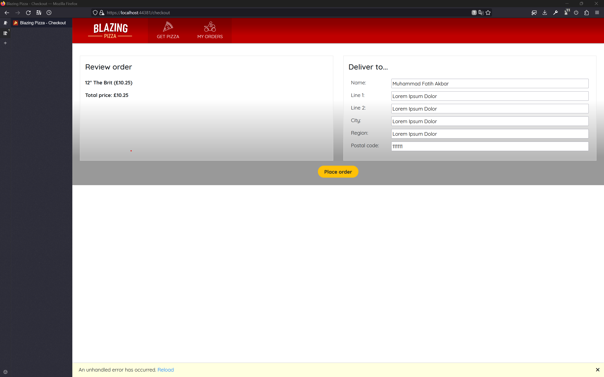
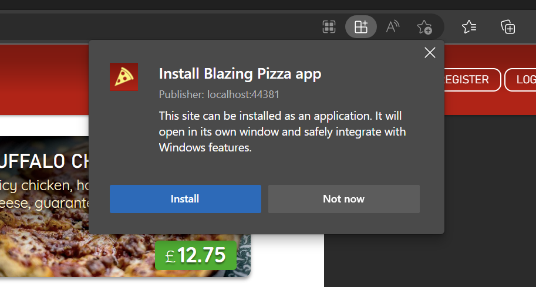

# Framework Programming Assignment - 7

Muhammad Fatih Akbar  
5025201117

Framework Programming IUP

Based on the [Dot Net - Blazor Workshop](https://github.com/dotnet-presentations/blazor-workshop).

## Table of Content

- [Session 1](#session-1)
- [Session 2](#session-2)
- [Session 3](#session-3)
- [Session 4](#session-4)
- [Session 5](#session-5)
- [Session 6](#session-6)
- [Session 7](#session-7)
- [Session 8](#session-8)
- [Session 9](#session-9)

## Session 1

Add component and layout

## Session 2

## Session 3

## Session 4

## Session 5

## Session 6

## Session 7

## Session 8

replaced some bits from session 7.

## Session 9

